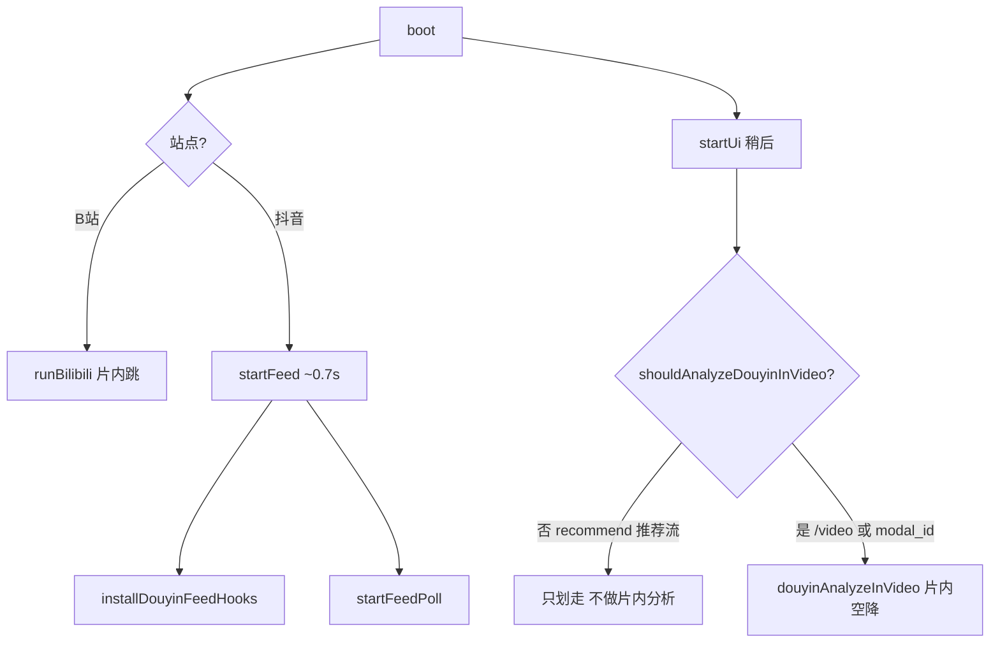
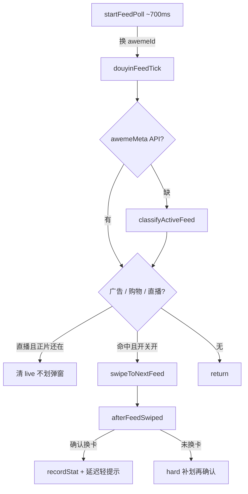
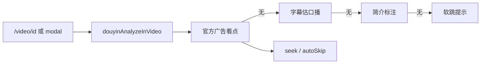

# Media Ad Skip

> **像绯红之王一样删除广告时间。**  
> 这不是广告拦截，这是时间删除。

[](https://github.com/hualeide/media-ad-skip/releases/latest)
[](https://developer.chrome.com/docs/extensions/mv3/intro/)
[](#-作用)
[](LICENSE)

B站 + 抖音**网页版**片内 / 信息流广告跳过工具。提供 **Chromium / Firefox 扩展（MV3）** 与 **油猴脚本** 两种形态，核心逻辑同源。

> **安装**：打开 [一页安装说明](https://hualeide.github.io/media-ad-skip/)（下载 ZIP → 按浏览器步骤加载）。  
> **仅在 B站、抖音页面注入**；其它网站不会运行。隐私说明见 [`extension/PRIVACY.md`](extension/PRIVACY.md)。  
> **始终最新包**：[Releases / latest](https://github.com/hualeide/media-ad-skip/releases/latest) · [直链 ZIP](https://github.com/hualeide/media-ad-skip/releases/latest/download/media-ad-skip-extension.zip)（固定文件名，随最新 Release 更新）

---

## 🚀 极速上手

推荐先看 **[一页安装说明](https://hualeide.github.io/media-ad-skip/)**。未上架商店：同一份 `extension/` 可装到多款浏览器。

| 浏览器 | 扩展页 | 说明 |
|--------|--------|------|
| **Chrome** | `chrome://extensions/` | 加载已解压 → 选 `extension/` |
| **Edge** | `edge://extensions/` | 同上 |
| **Brave** | `brave://extensions/` | Chromium，同上 |
| **Opera** | `opera://extensions/` | Chromium，同上 |
| **Vivaldi** | `vivaldi://extensions/` | Chromium，同上 |
| **Firefox** | `about:debugging#/runtime/this-firefox` | 「临时载入附加组件」→ 选 `extension/manifest.json`（重启后需再载） |

### 1. 拿到代码

任选其一：

- **推荐（最新扩展包）**：[直链 ZIP](https://github.com/hualeide/media-ad-skip/releases/latest/download/media-ad-skip-extension.zip)（解压后应直接有 `manifest.json`）
- **Release 页**：[Latest Release](https://github.com/hualeide/media-ad-skip/releases/latest)
- **GitHub 源码**：打开 [本仓库](https://github.com/hualeide/media-ad-skip) → 绿色 **Code** → **Download ZIP** → 再进 `extension/`
- **Git**：`git clone https://github.com/hualeide/media-ad-skip.git`

确认目录里有：`manifest.json`、`background.js`、`content/`（选 **这一层**，不是仓库根目录）。

### 2. Chromium 系（Chrome / Edge / Brave / Opera / Vivaldi）

1. 打开上表对应扩展页，打开 **开发者模式**。
2. **加载已解压的扩展程序** → 选 **`extension/`**。
3. 工具栏固定 **Media Ad Skip**。

> ⚠️ 选成仓库根目录（没有直接的 `manifest.json`）会失败。

### 3. Firefox

1. 地址栏打开 `about:debugging#/runtime/this-firefox`
2. **临时载入附加组件** → 选 `extension/manifest.json`
3. 需要 **Firefox 121+**；临时附加组件在浏览器重启后会卸掉，再按上面载一次即可

### 4. 开始用

1. 打开 [B站视频页](https://www.bilibili.com/) 或 [抖音网页版](https://www.douyin.com/)（**只有这两个站会注入脚本**）。
2. 点扩展图标：可 **立即跳过 / 撤销 / 本集不跳 / 标错了 / 重新分析**。
3. 详细开关在扩展 **「选项」** 页。
4. 跳过成功后右下角 toast，可撤销。

### 5. 改代码 / 更新后怎么刷新

1. 若改了油猴源 `media-ad-skip.user.js`：
   ```bash
   node scripts/build-extension-content.mjs
   ```
2. Chromium：扩展页点 **重新加载**；Firefox：调试页重新临时载入。
3. **关掉旧的 B站 / 抖音标签再新开**。

### 6. 装不上时对照表

| 现象 | 处理 |
|------|------|
| 加载报错 / 找不到 manifest | 选的目录不对 → 选 `extension/`（或 Firefox 选其中的 `manifest.json`） |
| Firefox 拒绝 service_worker | 需 121+；本包已同时声明 `background.scripts` |
| 扩展在，但视频页没反应 | 确认是 `bilibili.com` / `douyin.com`；重载后新开标签 |
| 抖音标签卡死、崩 | 选项里先关掉「信息流广告 / 直播卡」；尽量进具体视频页再测 |
| 权限变更后异常 | 扩展页重新加载；必要时移除后再装 |

---

## 作用

看视频时尽量少点「跳过」：到广告段自动 `seek` 到正片，误跳可撤销。

| 平台 | 做什么 |
|------|--------|
| **B 站** | 跳片内恰饭段：SponsorBlock 社区标注优先；辅以章节/简介、字幕品牌词、弹幕时间戳 |
| **抖音** | 跳长视频口播广告：官方「广告看点」、字幕轨估跳、页面「跳过广告」按钮；信息流可划走广告/直播卡 |
| **通用** | 右下角 toast：撤销 / 本集不跳 / 标错了；设置页可改品牌词、黑名单、软跳秒数、SponsorBlock 等 |

**不做什么**：不破解会员、不拦开屏闪屏类系统广告、不上传观看账号或历史。

## 原理（简要）

整体是「**检出广告时间段 → 播放头进入段内则 seek 到段末**」，不改视频文件、不劫持解码。抖音推荐流另走「识别卡片 → 划到下一条」。

### 启动分流



### 抖音推荐流：划走



判定顺序：API 标记 → DOM（广告 SVG / 购物入口 / 整卡 LivePlayer）→ 弹窗闸门 → 广告优先于购物、直播 → 先滑后提示。

| URL | 行为 |
|-----|------|
| `douyin.com/?recommend=1` | 只**划走**信息流广告/带货（及你开启的直播卡） |
| `/video/数字` 或 `modal_id=` | 划走 + **片内空降** |

### 抖音详情：片内



### B 站

1. 用 `bvid` 请求 [SponsorBlock](https://bsbsb.top) 公开分段（可关）。
2. 无 SB 或需补充时：章节/简介、「广告开始～结束」、字幕与弹幕品牌词/时间戳。
3. `watchPlayback` 约每 400ms 检查；进入区间则 `seek` 到段末。

### 双形态

| | 扩展 | 油猴 |
|--|------|------|
| 入口 | [`extension/`](extension/) | [`media-ad-skip.user.js`](media-ad-skip.user.js) |
| 设置 | `chrome.storage` + 选项页/弹窗 | `GM_*` + 菜单 |
| 构建 | 改油猴后执行下方 build，再重载扩展 | 直接改脚本 |

```bash
node scripts/build-extension-content.mjs
```

## 油猴（可选）

若你更习惯脚本管理器：安装 Tampermonkey 后导入 [`media-ad-skip.user.js`](media-ad-skip.user.js)。**推荐仍用扩展**（设置页更完整）。

## 自测

```bash
node scripts/self-test.mjs
node scripts/round-test.mjs
```

## 许可

[MIT](LICENSE)
